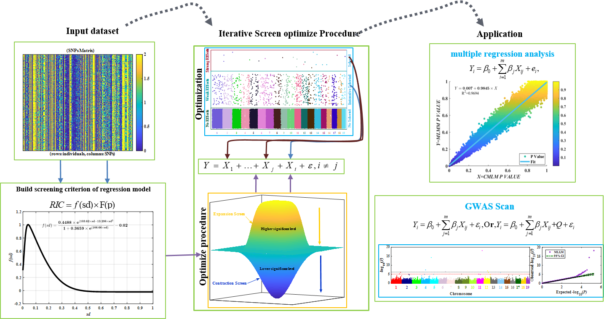
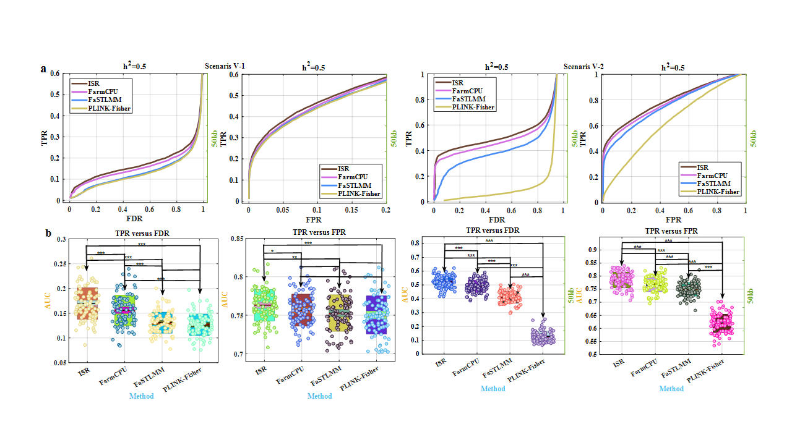
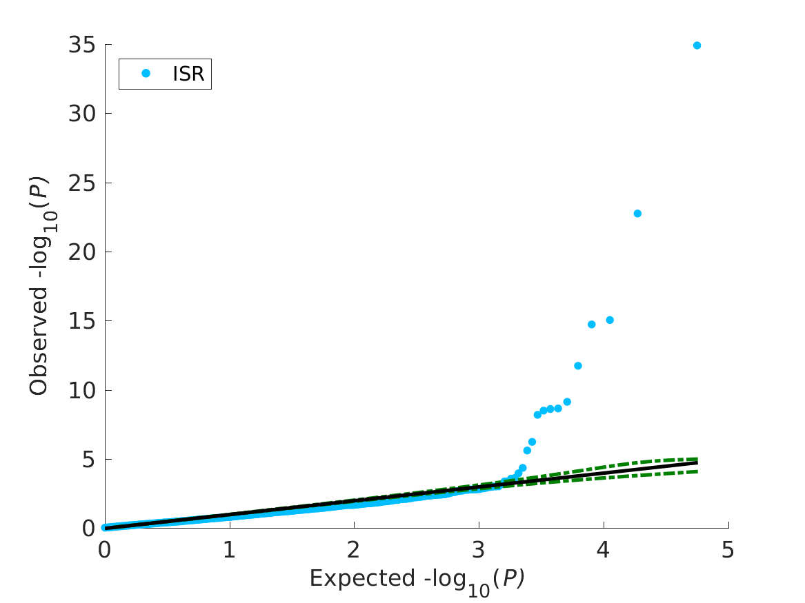
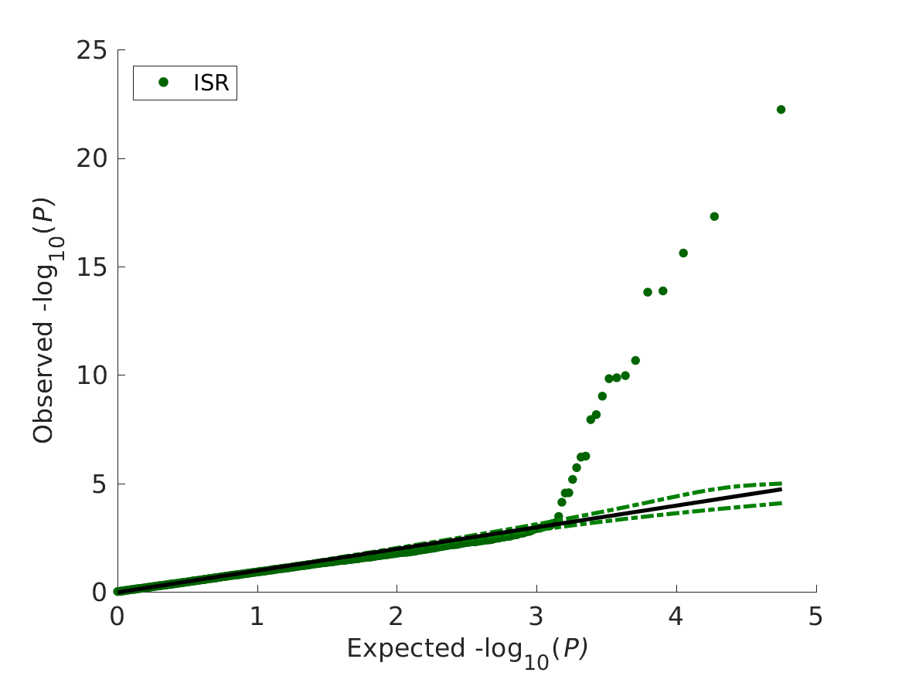

### ISR-MLLM For GWAS scan and epistatsis scan（Mult-Loci Linear Model Based on Iterative screen regression）

<div align="center"><a href=""></a></div>

#### Compared result
<div align="center"><a href=""></a></div>

> So this GWAS Schematic based on our proposed statistical method, iterative Screen Regression (ISR), which construct firstly new model selection criteria RIC (Regression Information Criteria) and then using special variable selection procedure to maximize the RIC, in order to achieve the optimal dissecting of genetic effects of complex traits. We mainly applied to detect epistasis and additive effects in genome-wide association analysis (GWAS) and genomic selection (GS).

# Installation
>Only need to install [MATLAB](https://www.mathworks.com/products/matlab.html), and the code can compile in linux and windows.
# Data Preparation
## Missing genotypes 
>The ISR method rely on having complete or imputed genotype data at each SNP. That is, ISR requires the user to impute all missing genotypes before perform association testing. This imputation step is arguably preferable than simply dropping individuals with missing genotypes, since it can improve power to detect associations. Therefore, for fitting ISR that missing genotypes are recommended to be imputed first. Otherwise, the missing genotypes for SNPs which replaced  with the estimated mean or median genotype of that SNP in ISR. 

## Missing Phenotypes
>Individuals with missing phenotypes will not be included in the ISR analysis. If all individuals have missing phenotypes, then no SNP and no individuals will be included in the analysis.

## Input File Formats
>ISR requires four input files containing genotypes, phenotypes,and covariates (optionally). Genotype and phenotype files can be in two formats, which the PLINK binary [traw (recommended)](https://www.cog-genomics.org/plink/1.9/formats#traw), [bed](https://www.cog-genomics.org/plink/1.9/formats#bed),  and [vcf](https://samtools.github.io/hts-specs/VCFv4.2.pdf) formats. which bed and vcf formats only can run in linux,and using [PLINK](https://www.cog-genomics.org/plink/2.0/) software recode to .traw format that codes genotypes using 0/1/2.

### Phenotype File
> Reformat the phenotype files in the same order of [.fam](https://www.cog-genomics.org/plink/1.9/formats#fam) (PLINK sample information file). The columns represented as following, included the six columns and both the phenotype value. Missing phenotype information is denoted as NA. The number of rows should be equal to the number of individuals in the genotype file.  
1. Family ID ('FID')
2. Within-family ID ('IID'; cannot be '0')
3. Within-family ID of father ('0' if father isn't in dataset)
4. Within-family ID of mother ('0' if mother isn't in dataset)
5. Sex code ('1' = male, '2' = female, '0' = unknown)
6. Phenotype value ('1' = control, '2' = case, '-9'/'0'/non-numeric = missing data if case/control) >- trait one 
7. trait two
8. ....
....

# Running ISR 
>Compile in linux enviroment. make sure in add alias in path like  "alias matlab='/mnt/d/linux/MATLAB2016b/bin/matlab -nodesktop -nosplash -singleCompThread -logfile `date +%Y_%m_%d-%H_%M_%S`.log -r'" before Running. A Small GWAS Example Dataset Running as following:
```linux
$ matlab "ISR_linux('phefile','../data/pop.fam','genofile','../data/pop.traw','sample',87,'nSNP',28228,'ntrait',1,'ncov',5),exit;
$ Basic Usage
Options :
phefile = ft_getopt(varargin, 'phefile', 'phe.fam');
genofile = ft_getopt(varargin, 'genofile', 'pop.traw');
outfile = ft_getopt(varargin, 'outfile', 'pop.traw.mat');
sample = ft_getopt(varargin, 'sample',[]);
nSNP = ft_getopt(varargin, 'nSNP', []);
ntrait = ft_getopt(varargin, 'ntrait', []);
chr = ft_getopt(varargin, 'nchr', []);
opt_outresult = ft_getopt(varargin, 'opt_outresult', 'ISR.opt.outresult.txt');
all_outresult = ft_getopt(varargin, 'all_outresult', 'ISR.outresult.txt');
vcf = ft_getopt(varargin, 'vcf', []);
bed = ft_getopt(varargin, 'bed', []);
ncov = ft_getopt(varargin, 'ncov', []);
IM = ft_getopt(varargin, 'IM', 1);
sgv = ft_getopt(varargin, 'sgv', 0.05); % default bonferroni correction
diary          = string, can be 'always', 'never', 'warning', 'error' (default = 'error')
timreq         = number, the time in seconds required to run a single job
timoverhead    = number in seconds, how much time to allow MATLAB to start (default = 180 seconds)
memreq         = number, the memory in bytes required to run a single job

```
## Output Files
> There will be two output files, both inside an output folder in the current directory. The pre-fix.log.txt file contains some detailed information about the running parameters and computation time. In addition, prefix.log.txt contains PVE estimate and its standard error in the null linear mixed model.

The ISR.outresult.txt contains the results. An example file with a few SNPs is shown below:
SNP	Chromosome	Position	Ft	P_F	Beta	SEbeta	R2
chr1_3913855	1	3913855	0.046 	8.3E-01	0.0111 	0.0517 	0.0001 
chr1_3913895	1	3913895	1.737 	1.9E-01	0.1237 	0.0939 	0.0034 
chr1_4680660	1	4680660	0.161 	6.9E-01	-0.0324 	0.0807 	0.0003 
chr1_4680664	1	4680664	0.572 	4.5E-01	-0.0841 	0.1113 	0.0011 
chr1_4680724	1	4680724	0.807 	3.7E-01	-0.0697 	0.0776 	0.0016 
chr1_4680752	1	4680752	1.333 	2.5E-01	-0.1330 	0.1151 	0.0026 
chr1_4680899	1	4680899	3.587 	6.2E-02	-0.1385 	0.0731 	0.0069 
>The eight columns are: snp ids, chromosome, base pair positions on the chromosome, F value and p value for F value, beta estimates, standard errors for beta, estimates each marker PVE. And ISR.opt.outresult.txt  only contain the significant marker after bonferroni correction in 5% default.

### dataViz in Manhattan and QQ plot
<p align="center">
<a href="/Fig/manhattan.bmp">

</a>
</p>
<p align="center">
<a href="/Fig/manhattan.bmp">

</a>
</p>
<p align="center">
<a href="/Fig/manhattan.bmp">

</a>
</p>
<p align="center">
<a href="/Fig/manhattan.bmp">

</a>
</p>

